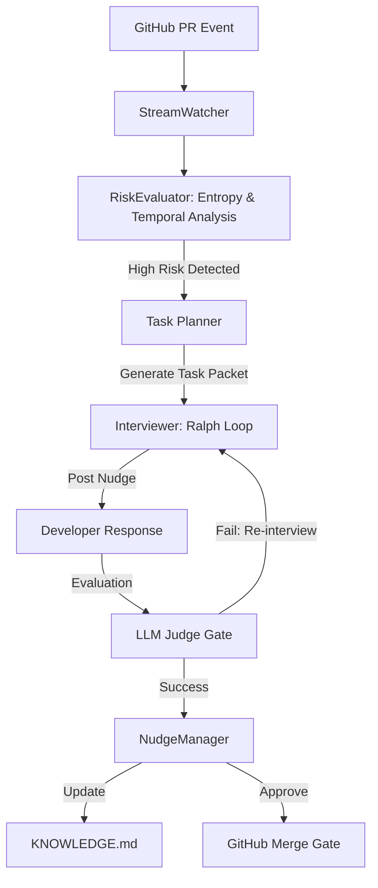

# TraceLedger: Architecture Design Document (Week 13)

**Project Name**: TraceLedger (AI 협업 컨텍스트 자산화 및 자동 런북 생성 시스템)
**Team**: trace-ledger
**Lead / Architect**: 202321006 / 김준서

---

## 1. Problem Statement
In software engineering teams, critical design knowledge often becomes concentrated in a single individual (Bus Factor: 1). This "Knowledge Monopoly" is usually only discovered after a member leaves, leading to high maintenance costs and technical debt. Current documentation is often outdated and manual. 

**Solution**: An autonomous agent that detects knowledge silos in real-time during Pull Requests and uses the **Ralph Loop** to interview developers, extracting high-quality architectural rationale and persisting it into a knowledge base.

---

## 2. Agent Architecture Diagram



---

## 3. Mapping to Agent OS Runtime Layers (L1-L7)

| Layer | Implementation in Nudge Agent |
|-------|------------------------------|
| **L1 MCP Tool Protocol** | `github_comment`, `file_read`, `git_log_analyzer` tools via GitHub API. |
| **L2 Provider Completion** | Using Anthropic Claude 3.5 Sonnet for reasoning and evaluation. |
| **L3 Collaboration** | Planner (Risk detection) -> Worker (Interviewer) -> Reviewer (LLM Judge) loop. |
| **L4 Event Store** | All agent actions and developer responses logged in `.events.jsonl` for replay. |
| **L5 Skill Runtime** | Role-specific instructions for "Senior Architect" persona and "Ralph Loop" logic. |
| **L6 Hook Lifecycle** | Triggered on PR synchronization; Blocks merge until knowledge is extracted. |
| **L7 Schema IPC** | Standardized `Task Packet` for interview missions and `Review Verdict` for judge results. |

---

## 4. Task Packet Schema

```json
{
  "task_id": "nudge-run-20260601-001",
  "objective": "Extract architectural rationale for a high-risk module",
  "scope": {
    "file": "src/auth/auth_manager.py",
    "top_author": "kjs0113",
    "risk_metrics": {
      "risk_score": 88.5,
      "entropy": 0.15,
      "temporal_share": 0.92
    }
  },
  "acceptance_criteria": [
    "Response must contain 'Why' (Rationale)",
    "Length must be over 50 characters",
    "Response must be consistent with code changes"
  ],
  "budget": {
    "max_turns": 3,
    "max_tokens": 50000
  }
}
```

---

## 5. Evaluation Gates
1. **Deterministic Gate**: 
   - `Risk Score > 70` (Calculated via UKRE engine).
   - `Commit Count >= 3`.
2. **LLM Judge Gate**:
   - Evaluates developer response for "Information Density" and "Rationale Inclusion".
3. **Human Review**:
   - Final approval of the extracted knowledge entry in `KNOWLEDGE.md`.

---

## 6. Risk Register

| Risk | Trigger | Owner | Response |
|------|---------|-------|----------|
| API Rate Limit | High volume of PRs | Lead | Implement delay queue and batching. |
| Low Dev Engagement | Repetitive rejection | Agent Eng | Tune persona to be more "Zero-Draft" friendly. |
| Analysis False Positive | Low complexity file flagged | Architect | Refine 'Logic Density' weights in UKRE. |

---

## 7. ADR (Architecture Decision Records)

### ADR-001: Use Shannon Entropy for Risk Assessment
- **Context**: We need an objective way to measure knowledge imbalance.
- **Decision**: Implement Shannon Entropy to measure the distribution of commit weights.
- **Consequences**: Provides a mathematically sound "Monopoly Score" beyond simple percentages.

### ADR-002: Exponential Temporal Decay for History
- **Context**: Old commits might not represent current knowledge owners.
- **Decision**: Apply a 180-day half-life decay to git logs.
- **Consequences**: Prioritizes current active maintainers for interviews.

### ADR-003: Ralph Loop for Knowledge Extraction
- **Context**: Developers often give short, uninformative answers.
- **Decision**: Use a multi-turn feedback loop (Ralph Loop) to nudge for more detail.
- **Consequences**: Higher quality knowledge capture at the cost of more API calls.

---

## 8. Demo Scenario
1. **Phase 1**: Developer pushes a complex code change to a module they have monopolized.
2. **Phase 2**: Nudge Agent detects the risk using the UKRE engine and posts a rationale request on the PR.
3. **Phase 3**: Developer gives a short answer. Agent rejects and asks for specific design reasons (Ralph Loop).
4. **Phase 4**: Developer provides a detailed answer. Agent accepts, updates `KNOWLEDGE.md`, and approves the PR.
